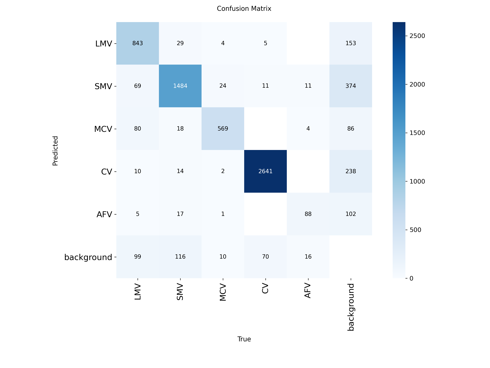

# MV-RSD YOLO: Object Detection on Military Vehicles Dataset

A professional deep learning project for training and evaluating object detection models on the **MV-RSD (Military Vehicle Remote Sensing Dataset)** using **YOLOv8n** and **YOLO12m** architectures.

---

## 🚀 Overview

This repository contains all resources and results related to training YOLO models for object detection on satellite images of military vehicles. The goal is to detect and classify five classes of vehicles in low-resolution aerial images.

- Dataset: [MV-RSD Dataset](https://www.scidb.cn/en/detail?dataSetId=2731ac4153464495b4dfd3caa8a9b0a0) *(downloaded from SciDB)*
- Models trained:
  - `YOLOv8n` (lightweight baseline)
  - `YOLO12m` (mid-weight architecture for better performance)


## 🧠 Project Highlights

| Model    | Box Precision | Recall | mAP\@0.5 | mAP\@0.5:0.95 |
| -------- | ------------- | ------ | -------- | ------------- |
| YOLOv8n  | 0.879         | 0.79   | 0.877    | 0.614         |
| YOLO12m  | 0.852         | 0.832  | 0.877    | 0.624         |

## 🏋️‍♂️ Training Instructions

```bash
# Train YOLOv8n
yolo detect train \
  data=data.yaml \
  model=yolov8n.pt \
  epochs=50 \
  imgsz=640 \
  batch=16 \
  project=results \
  name=8n_run

# Train YOLO12m
yolo detect train \
  data=data.yaml \
  model=yolo12m.pt \
  epochs=50 \
  imgsz=640 \
  batch=10 \
  cache=True \
  project=results \
  name=12m_run
```


---

## 📷 Example Results

YOLO12m


 


YOLOV8n



 


> 🔎 Class-wise mAPs:
>
| Class | YOLOv8n mAP50 | YOLO12m mAP50  |
| ----- | ------------- | -------------- |
| LMV   | 0.896         | 0.921          |
| SMV   | 0.901         | 0.913          |
| MCV   | 0.938         | 0.901          |
| CV    | 0.980         | 0.980          |
| AFV   | 0.671         | 0.671          |

---
## 📈 Evaluation & Discussion

- **Results Interpretation**: Both models achieved strong detection scores, with **YOLOv8n** slightly outperforming **YOLO12m** in overall mAP50 despite having far fewer parameters. The larger model, while more capable in theory, did not generalize significantly better under current training constraints.

- **Limitations**:

  - Small vehicles like AFVs performed the worst across both models.
  - Image quality and resolution limited detection accuracy.
  - Overlapping objects and low variation in lighting/weather impacted generalization.

- **Takeaways**:

  - A well-tuned smaller model (YOLOv8n) may be more efficient for edge deployments.
  - Improvements in data quality, better augmentation, or using higher input resolutions could enhance results.
  - Future experiments could test focal loss or dataset rebalancing.

---

## 🛠 Requirements

- Python 3.10+
- PyTorch 2.0+
- CUDA GPU (4GB VRAM minimum)

Install dependencies (recommended inside a virtual environment):

```bash
pip install -r requirements.txt
```

---

## ⚖️ License

This project is released under the MIT License. You are free to use, modify, and distribute.

---

## 🙋‍♂️ Author

**Yusuf Soylemez**\
Aspired AI Engineer | Passionate about computer vision, real-time systems, and ML pipelines.

---

## 📌 Notes

- This project is part of a professional portfolio demonstrating end-to-end ML model development.
- Data source acknowledged: SciDB
- Long training times due to hardware limitations (YOLOv12m took \~50 hours on RTX 3050 Ti)

---

## ⭐ Contributing

Feel free to fork this repo, submit issues or pull requests!

